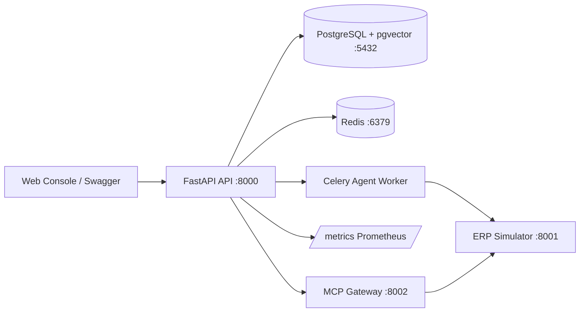

# ERP Agent Copilot V6

把自然语言 ERP 业务需求编译为**可解释、可审批、可恢复**的跨系统工具调用 DAG。受状态机、权限策略、业务规则和审计约束的 Agent Runtime，而非普通问答机器人。

## 架构



四个可运行进程 + 两个基础设施服务 + 监控栈。`infra/docker-compose.yml` 一键编排全部 8 个服务（Postgres、Redis、四个应用进程、Prometheus、Grafana）；开发迭代也可只起 Postgres+Redis、四个应用用 `uv run` 在宿主机运行。

## 技术栈

FastAPI + Pydantic v2 · LangGraph 强类型状态机 · Celery + Redis · PostgreSQL + SQLAlchemy + Alembic · pgvector + PostgreSQL FTS 混合检索 · MCP Python SDK · OpenTelemetry + Prometheus · pytest。

## 一键启动

### 1. 全栈容器化（推荐）

`infra/docker-compose.yml` 一键编排全部 8 个服务：Postgres、Redis、四个应用进程（api / worker / erp_simulator / mcp_gateway）、Prometheus、Grafana。

```bash
docker compose --env-file .env -f infra/docker-compose.yml up -d
uv run alembic upgrade head
```

端口：API :8000 · Simulator :8001 · MCP Gateway :8002 · Prometheus :9090 · Grafana :3000。Postgres/Redis/Prometheus/Grafana 端口仅绑 127.0.0.1，应用端口 8000~8002 暴露本机网卡（生产前置于防火墙后）。

> Grafana 需 `GRAFANA_ADMIN_PASSWORD`（已在根 `.env`；未设置则 compose 启动失败）。

### 2. 仅基础设施 + 宿主机运行应用（开发迭代）

两种模式互斥（应用端口 8000~8002 重叠）。需要热重载 / 断点调试时用此模式：

```bash
docker compose --env-file .env -f infra/docker-compose.yml up -d postgres redis
uv run alembic upgrade head
```

四个进程（四个终端）：

```bash
# API :8000
uv run uvicorn apps.api.main:create_app --factory --port 8000
# ERP Simulator :8001
uv run uvicorn apps.erp_simulator.simulator:create_simulator_app --factory --port 8001
# Agent Worker（消费 Run）
uv run celery -A apps.worker.celery_app worker --loglevel=info
# MCP Gateway :8002
uv run uvicorn apps.mcp_gateway.gateway:create_gateway_app --factory --port 8002
```

Swagger：`http://localhost:8000/docs`。

### 3. 评测 / 基准 / 故障注入

```bash
uv run evals/run_all.py                       # 200 条六大分类评测
uv run python evals/scripts/run_security_eval.py   # 25 条安全守卫
uv run python evals/scripts/run_ablation.py        # 42 条检索消融
uv run python tests/performance/fault_injection.py # 故障注入 3/3
uv run pytest tests/unit                      # 单元测试（1063 通过）
uv run mypy src                               # 类型检查（62 文件干净）
```

## 文档

**最终交付文档**（本仓库当前状态的准确描述）：

| 文档 | 内容 |
|---|---|
| [docs/product.md](docs/product.md) | 产品定位、目标用户、演示场景、V5→V6 边界 |
| [docs/architecture.md](docs/architecture.md) | 系统边界、架构图、技术栈、模块结构 |
| [docs/api-contracts.md](docs/api-contracts.md) | API 契约、错误模型、数据实体、Run 状态机 |
| [docs/evaluation.md](docs/evaluation.md) | 评测框架、数据集、指标、可观测性 |
| [docs/threat-model.md](docs/threat-model.md) | 五层防护、威胁与缓解对照、剩余风险 |
| [docs/benchmark.md](docs/benchmark.md) | 实测基准、检索消融、故障注入、负载测试 |

**详细设计**（逐任务的原始文档）：`docs/01`~`docs/11`（产品场景 / 系统架构 / Agent Runtime / 知识检索 / 工具与 MCP / 安全审批恢复 / API 与事件 / 评测可观测性 / 实施路线 / 详细任务清单 / ADR）。任务进度见 [docs/10-detailed-task-list.md](docs/10-detailed-task-list.md)。

## 目录结构

```text
apps/           进程入口（api, worker, mcp_gateway, erp_simulator）
src/erp_copilot/ 核心库（domain, application, agent, retrieval, tools,
                 memory, security, observability, infrastructure）
evals/          评测数据集、评分器、harness、脚本与报告
tests/          单元 / 集成 / 评测 / 性能（含故障注入、Locust）
docs/           产品、架构、API 契约、威胁模型、评测、基准
infra/          docker-compose.yml（8 服务全栈编排）+ Prometheus/Grafana 配置
migrations/     Alembic 版本化迁移
```

## 诚实边界

接线现状与依赖注意点，文档与代码保持一致地标注，避免把"目标"当成"已实现"：

- `POST /v1/knowledge/search` 已接入完整检索管线（embed → 向量 → 关键词 → RRF → rerank）；Worker `execute_run` 由完整 LangGraph 驱动（确定性 planner → validate → policy → executor → verify，Checkpoint 绑定 DB 会话）。
- `evals/run_all.py` 六分类全部跑真实逻辑（`tool_retrieval`/`planning`/`recovery`/`security`/`failure` 为 `deterministic`，`knowledge_rag` 为 `retrieval_pipeline`）；其中 `knowledge_rag` 需要本地 pgvector 测试库，离线单测中该分类注入 fake runner。
