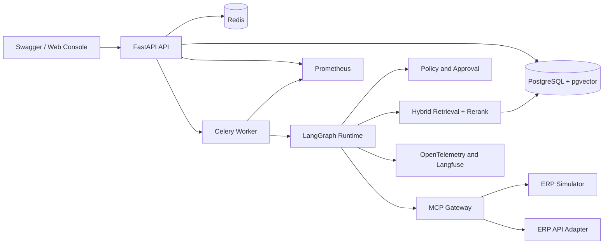

# ERP Agent Copilot系统架构

## 1. 架构原则

- API请求线程不直接执行长时间Agent任务。
- 领域规则不依赖FastAPI、Celery、数据库或模型SDK。
- 所有外部Tool通过统一Gateway执行，不允许Agent任意发起HTTP请求。
- Run状态、审批、事件和幂等信息必须持久化。
- 检索、LLM、MCP和Tool调用都必须带`run_id`和Trace上下文。
- 首版保持四个主要进程，避免无收益的微服务拆分。

## 2. 逻辑架构



## 3. 进程边界

### API Service

职责：

- 身份认证、租户校验和请求Schema校验。
- 创建Run并返回`202 Accepted`和`run_id`。
- 提供Run查询、SSE事件、审批、取消、Tool管理和知识导入接口。
- 不执行Agent节点，不持有长事务。

### Agent Worker

职责：

- 加载AgentState和Checkpoint。
- 执行检索、Planning、Policy、Tool和Verifier节点。
- 管理deadline、重试、恢复和上下文预算。
- 将大结果写入Artifact并保存摘要引用。

### MCP Gateway

职责：

- 维护持久MCP连接和Tool能力缓存。
- 将OpenAPI和MCP Tool统一为内部Tool Schema。
- 统一超时、错误码、响应大小、幂等和审计字段。
- 在请求发出前执行URL、Scope和参数安全校验。

### ERP Simulator

职责：

- 根据`scenario_id`提供确定性的商品、库存、供应商、订单和业务规则数据。
- 支持ERP查询Tool和有状态写Tool。
- 写操作支持幂等键、状态重置和操作历史查询。
- 模拟超时、暂时性错误、永久错误和大响应。

## 4. 模块边界

```text
domain
  ↑
application
  ↑
agent / retrieval / tools / security
  ↑
infrastructure
  ↑
apps
```

- `domain`：Entity、Value Object、Enum、错误和领域不变量。
- `application`：Use Case、事务边界和Port接口。
- `agent`：状态图、Planner、Executor、Verifier。
- `retrieval`：导入、分块、检索、Rerank和引用。
- `tools`：注册、版本、MCP、OpenAPI和执行器。
- `security`：RBAC、Policy、SSRF、Redaction和Sandbox。
- `infrastructure`：数据库、Redis、LLM、VectorStore和Artifact Adapter。
- `apps`：进程入口、依赖注入和传输层。

依赖方向只能由外向内，领域层不得导入基础设施实现。

## 5. 数据存储

| 数据 | 存储 | 原因 |
|---|---|---|
| 用户、租户、Tool版本 | PostgreSQL | 需要事务、约束和版本管理 |
| Run、Step、事件、审批 | PostgreSQL | 需要一致性、审计和恢复 |
| 文档、Chunk元数据 | PostgreSQL | 便于租户过滤、版本和业务引用 |
| 向量 | pgvector | 首版本地部署简单并支持混合检索 |
| 队列和短期缓存 | Redis | Celery Broker、结果通知和限流 |
| 大Tool结果 | 本地或MinIO Artifact Store | 避免数据库行和Prompt过大 |
| Trace | OpenTelemetry后端、Langfuse | 分析跨组件调用和LLM行为 |

## 6. 请求链路

```text
POST /v1/runs
  → 鉴权与租户校验
  → 创建Run和初始事件
  → 投递Celery任务
  → Worker加载状态
  → LangGraph执行节点
  → 事件持续写入PostgreSQL并推送SSE
  → 成功、失败、取消或等待审批
```

审批时不占用Worker：状态持久化后结束当前任务；审批API写入决策并重新投递Run。

## 7. 部署拓扑

本地开发使用Docker Compose启动：

- `api`
- `worker`
- `mcp-gateway`
- `erp-simulator`
- `postgres`
- `redis`
- `otel-collector`
- 可选`langfuse`、`prometheus`和`grafana`

首版不要求Kubernetes。生产化讨论可以描述水平扩展API和Worker，但[REDACTED]指标必须来自实际测试环境。

## 8. 关键故障边界

- API重启：已创建Run不丢失，客户端可重新连接SSE。
- Worker重启：从最后Checkpoint恢复。
- Redis短暂不可用：新任务入队失败应明确返回，不伪造成功。
- PostgreSQL不可用：禁止执行无法审计的写操作。
- MCP断连：Gateway重连并重新发现能力。
- LLM失败：按错误类型重试或降级，禁止无限循环。
- ERP Tool超时：记录Step失败并由策略决定重试、replan、补参或转人工。
