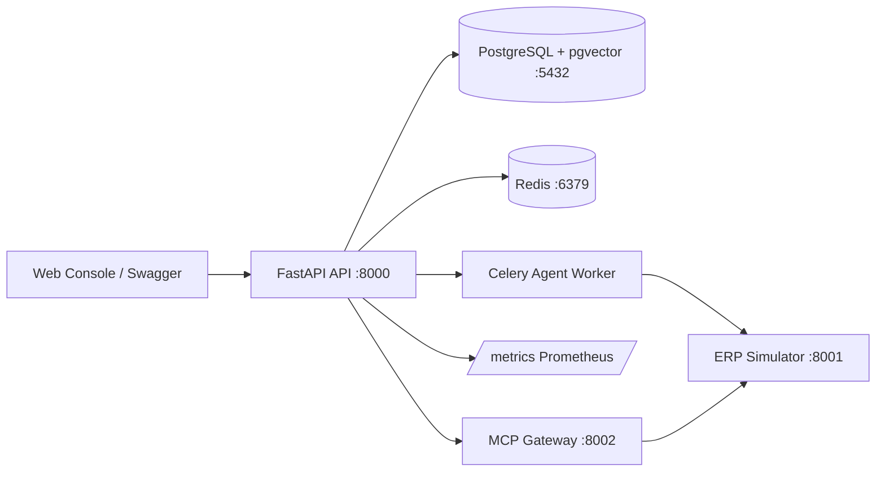

# 系统架构：ERP Agent Copilot V6

> 最终交付文档。反映**当前已实现**的边界与组件；详细设计与 ADR 见 `docs/02-system-architecture.md`、`docs/03-agent-runtime.md`、`docs/04-knowledge-and-retrieval.md`、`docs/05-tools-mcp-and-simulator.md`、`docs/11-architecture-decisions.md`。

## 1. 系统边界与进程

首版只保留四个可运行进程，内部按模块解耦，不拆微服务。

| 进程 | 入口 | 职责 | 运行方式 |
|------|------|------|----------|
| API | `apps/api` | 校验、鉴权、任务提交、工具/知识库/审批接口、`/metrics` | `uvicorn`，:8000 |
| Agent Worker | `apps/worker` | Celery 消费 Run，执行任务并写 RunStep | `celery worker` |
| MCP Gateway | `apps/mcp_gateway` | 持久 MCP 连接与服务器清单 | `uvicorn`，:8002 |
| ERP Simulator | `apps/erp_simulator` | 确定性产品/库存/供应商/订单 + 场景切换 | `uvicorn`，:8001 |

基础设施：PostgreSQL（pgvector/pgvector:pg17，:5432）、Redis（redis:7-alpine，:6379）。`infra/docker-compose.yml` 一键编排全部 8 个服务（Postgres、Redis、四个应用进程、Prometheus、Grafana）；开发迭代也可只起 Postgres+Redis、四个应用用 `uv run` 在宿主机运行。

## 2. 架构图



## 3. 技术栈

| 层 | 选择 | 说明 |
|---|---|---|
| API | FastAPI + Pydantic v2 | 异步、类型契约、自动 OpenAPI 文档 |
| Agent | LangGraph + 强类型 AgentState | 状态图建模，比顺序 while 循环更安全 |
| 异步任务 | Celery + Redis | 长任务、重试、队列 |
| 事务数据 | PostgreSQL + SQLAlchemy + Alembic | 事务保证、版本化迁移 |
| 向量检索 | pgvector + PostgreSQL FTS | 混合检索，本地部署简单 |
| 工具协议 | MCP Python SDK | Agent 标准工具协议 |
| 重排序 | Cross-Encoder / Qwen Rerank（可插拔，含 Dummy 回退） | 两阶段检索 |
| 可观测性 | OpenTelemetry + Prometheus + Langfuse SDK | Trace / 指标 / LLM 调用 |
| 测试 | pytest + TestClient + respx | 单元 / 集成 / e2e / 评测 / 性能 |
| 工程质量 | uv、ruff、mypy、pre-commit | 可复现环境与规范 |

## 4. 模块结构（src/erp_copilot，共 54 个 .py）

```text
domain/         领域实体、枚举、统一错误模型（不依赖框架）
application/    用例与事务边界（Tool 导入、失败队列）
agent/          AgentState、LangGraph 状态机、Plan DAG、重试策略、崩溃恢复
agent/nodes/    classify_intent / retrieve_context / build_plan / validate_plan
                / policy_check / execute_steps / verify_results / request_approval
retrieval/      L1 Rules 匹配、文档导入、Embedding、混合检索、Rerank、引用、指标
tools/          Tool Registry、OpenAPI 导入、候选过滤、幂等存储、ToolResult、MCP 网关
memory/         Checkpoint 持久化与恢复
security/       SSRF 出口控制、审批决策、Prompt Injection 检测、输出 Redaction
observability/  结构化日志、OpenTelemetry Trace、Prometheus 指标、LLM 调用采集
infrastructure/ 数据库引擎、Settings、Celery 配置
```

依赖方向：`domain ← application/agent/retrieval/tools/security ← infrastructure/observability`。领域层不依赖任何框架；所有可测性通过依赖注入（Session、HTTP client、clock、llm_complete 等可注入）。

## 5. Agent Runtime

### 5.1 强类型状态

`AgentState` 携带 `run_id / tenant_id / user_id / query`、`intent`、`plan`、`step_results`、`approvals`、`errors`、`status` 等字段，Pydantic `extra="forbid"` 拒绝未知字段，可 `model_dump_json()` 持久化。运行时生命周期 `AgentStatus`（QUEUED → PLANNING → WAITING_APPROVAL → EXECUTING → VERIFYING → SUCCEEDED，含 RETRYING/REPLANNING/FAILED/CANCELLED/EXPIRED）与持久化 `RunStatus` 分离，由 checkpoint 映射。

### 5.2 状态机（LangGraph）

节点：`classify_intent → retrieve_context → build_plan → validate_plan → policy_check → request_approval（高风险暂停）→ execute_ready_steps → verify_results → recover_or_replan → finalize`。

图拓扑在 `agent/graph.py` 用条件路由实现（审批门控、恢复/重规划分支）。`build_agent_graph(...)` 允许注入节点实现，`agent/nodes/` 提供完整实现，各自有独立单测。

> 现状说明：Celery worker 的 `execute_run` 任务当前是一条**简化直连路径**——直接查询 ERP Simulator 并记录 RunStep，尚未把上述完整 LangGraph 状态机接入 worker 执行链路。Agent Runtime 各节点作为可注入、可测试的组件已交付；接入 worker 是后续集成点（见 `docs/03-agent-runtime.md`）。

### 5.3 Plan DAG

`PlanStep` 携带 `step_id / tool_name / depends_on / arguments / argument_sources / risk_level / required_scope / requires_approval / timeout_s / max_retries / idempotency_key / expected_output_schema / success_condition / fallback`。`validate_plan` 确定性校验 DAG 合法性、拓扑序、并行组；只读且依赖满足的步骤允许并行，写步骤默认串行。

### 5.4 Checkpoint 与恢复

`CheckpointSaver` 在每个图节点后把完整 `AgentState` 快照持久化到 `agent_checkpoints`，立即提交。Worker 崩溃后 `RunRecovery.load` 加载最新 checkpoint，对账 `idempotency_records`：PENDING 写步骤标 `RECOVERY_RECONCILIATION_REQUIRED`，COMPLETED 记录/步骤永不重跑。

## 6. 知识检索

两层：**L1 Rules**（`rule_matcher` 用 `intent_rule_map.yaml` 确定性匹配意图→规则）→ **L2 RAG**（文档导入分块 → Embedding 入 pgvector + jieba 分词 FTS → RRF 融合 → Rerank → 引用装配）。离线指标 `recall_at_k / MRR / NDCG / precision_at_k` 见 `retrieval/metrics.py`，实测消融见 `docs/benchmark.md`。

## 7. 工具与 MCP

- `ToolRegistry`：按租户管理工具与版本；`OpenAPIImporter` 解析 OpenAPI 3.x 为工具定义。
- `IdempotencyStore`：写操作 at-most-once（PENDING 意图 → 执行 → COMPLETED），DB 唯一约束防并发冲突。
- `MCPGateway`：基于 MCP SDK 的持久连接管理（惰性连接、自动重连、`execute_tool`）；`apps/mcp_gateway` 暴露 `/health` 与 `/servers`。

## 8. 数据流（订单创建示例）

```
POST /v1/runs {tenant_id, title, product_name}
  → 写 runs 行（QUEUED）→ Celery 入队 → 返回 202 + run_id
Worker execute_run:
  → GET /products/苹果（Simulator，库存校验）
  → GET /suppliers?region=上海（供应商筛选）
  → 记录 RunStep → Run 置 COMPLETED
```

写操作路径（规划态）经 `policy_check` 门控 + `request_approval` 暂停 + 幂等键执行，避免重复副作用。

## 9. 可观测性

- OpenTelemetry：`tracing.py` 提供 `node_span()` 装饰器、W3C tracecontext 传播。
- Prometheus：`metrics.py` 暴露 `runs_created/completed/failed`、`phase_latency` 直方图、`worker_queue` 仪表，经 `/metrics` 输出。
- 结构化日志：`logging.py` JSON 格式化，TraceContext（run_id/step_id/request_id）经 contextvars 贯穿。
- LLM 调用：`langfuse.py` 采集模型、token、耗时与估算成本，经**官方 Langfuse SDK** 上报 `generation` observation；未配置 `LANGFUSE_PUBLIC_KEY`/`LANGFUSE_SECRET_KEY` 时自动降级为不采集（fail-open），采集失败不阻断 LLM 调用。

## 10. 部署与数据边界

- `docker compose --env-file .env -f infra/docker-compose.yml up -d` 一键启动全部服务（Postgres、Redis、四个应用进程、Prometheus、Grafana；Grafana 需 `GRAFANA_ADMIN_PASSWORD`）；Alembic 迁移位于 `migrations/`，启动后执行 `uv run alembic upgrade head`。
- 知识库保存业务规则/API 说明/流程；ERP Simulator 提供当前业务状态；PostgreSQL 保存 Run/Step/审批/事件/审计/评测；大型 Tool 结果存 Artifact。
- 任何真实密钥、个人敏感信息和生产数据不进入仓库或评测集。
